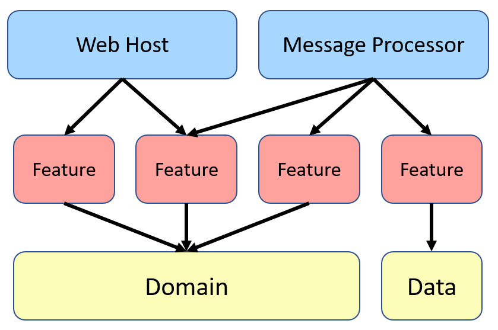

# 🧺 Store Golang Microservices Sample

> A practical store sample, built with Golang and different software architecture and technologies like **Microservices Architecture**, **Vertical Slice Architecture** , **CQRS Pattern**, **Domain Driven Design (DDD)**, **Event Driven Architecture**. For communication between independent services, We use asynchronous messaging with using kafka, and sometimes we use synchronous communication for real-time communications with using REST and gRPC calls.

🌀 This Application is `in-progress` and I will add new features and thecnologies over time. 

## Technologies - Libraries

- ✔️ **[`echo`](https://github.com/labstack/echo)** - High performance, minimalist Go web framework
- ✔️ **[`kafka-go`](https://github.com/segmentio/kafka-go)** - Kafka library in Go
- ✔️ **[`grpc-go`](https://github.com/grpc/grpc-go)** - The Go language implementation of gRPC. HTTP/2 based RPC
- ✔️ **[`pgx`](https://github.com/jackc/pgx)** - PostgreSQL driver and toolkit for Go
- ✔️ **[`swag`](https://github.com/swaggo/swag)** - Automatically generate RESTful API documentation with Swagger 2.0 for Go.
- ✔️ **[`jaeger-client-go`](https://github.com/jaegertracing/jaeger-client-go)** - Distributed tracing for go (will replace with open telemetry soon)
- ✔️ **[`client_golang`](github.com/prometheus/client_golang)** - Prometheus instrumentation library for Go applications
- ✔️ **[`mongo-go-driver`](https://github.com/mongodb/mongo-go-driver)** - The Go driver for MongoDB
- ✔️ **[`go-redis/redis`](https://github.com/go-redis/redis)** - Type-safe Redis client for Golang
- ✔️ **[`go-gorm/gorm`](https://github.com/go-gorm/gorm)** - The fantastic ORM library for Golang, aims to be developer friendly

## Application Structure

In this project I used [vertical slice architecture](https://jimmybogard.com/vertical-slice-architecture/) or [Restructuring to a Vertical Slice Architecture](https://codeopinion.com/restructuring-to-a-vertical-slice-architecture/) also I used [feature folder structure](http://www.kamilgrzybek.com/design/feature-folders/) in this project.

- We treat each request as a distinct use case or slice, encapsulating and grouping all concerns from front-end to back.
- When We adding or changing a feature in an application in n-tire architecture, we are typically touching many different "layers" in an application. we are changing the user interface, adding fields to models, modifying validation, and so on. Instead of coupling across a layer, we couple vertically along a slice and each change affects only one slice.
- We `Minimize coupling` `between slices`, and `maximize coupling` `in a slice`.
- With this approach, each of our vertical slices can decide for itself how to best fulfill the request. New features only add code, we're not changing shared code and worrying about side effects. For implementing vertical slice architecture using cqrs pattern is a good match.

Also here I used [CQRS](https://www.eventecommerce.com/cqrs-pattern) for decompose my features to very small parts that makes our application:

- maximize performance, scalability and simplicity.
- adding new feature to this mechanism is very easy without any breaking change in other part of our codes. New features only add code, we're not changing shared code and worrying about side effects.
- easy to maintain and any changes only affect on one command or query (or a slice) and avoid any breaking changes on other parts
- it gives us better separation of concerns and cross cutting concern (with help of MediatR behavior pipelines) in our code instead of a big service class for doing a lot of things.

With using [CQRS](https://event-driven.io/en/cqrs_facts_and_myths_explained/), our code will be more aligned with [SOLID principles](https://en.wikipedia.org/wiki/SOLID), especially with:

- [Single Responsibility](https://en.wikipedia.org/wiki/Single-responsibility_principle) rule - because logic responsible for a given operation is enclosed in its own type.
- [Open-Closed](https://en.wikipedia.org/wiki/Open%E2%80%93closed_principle) rule - because to add new operation you don’t need to edit any of the existing types, instead you need to add a new file with a new type representing that operation.

Here instead of some [Technical Splitting](http://www.kamilgrzybek.com/design/feature-folders/) for example a folder or layer for our `services`, `controllers` and `data models` which increase dependencies between our technical splitting and also jump between layers or folders, We cut each business functionality into some vertical slices, and inner each of these slices we have [Technical Folders Structure](http://www.kamilgrzybek.com/design/feature-folders/) specific to that feature (command, handlers, infrastructure, repository, controllers, data models, ...).

Usually, when we work on a given functionality we need some technical things for example:

- API endpoint (Controller)
- Request Input (Dto)
- Request Output (Dto)
- Some class to handle Request, For example Command and Command Handler or Query and Query Handler
- Data Model

Now we could all of these things beside each other and it decrease jumping and dependencies between some layers or folders.

Keeping such a split works great with CQRS. It segregates our operations and slices the application code vertically instead of horizontally. In Our CQRS pattern each command/query handler is a separate slice. This is where you can reduce coupling between layers. Each handler can be a separated code unit, even copy/pasted. Thanks to that, we can tune down the specific method to not follow general conventions (e.g. use custom SQL query or even different storage). In a traditional layered architecture, when we change the core generic mechanism in one layer, it can impact all methods.

## References

- [https://github.com/AleksK1NG/Go-CQRS-Kafka-gRPC-Microservices](https://github.com/AleksK1NG/Go-CQRS-Kafka-gRPC-Microservices)
- [https://github.com/ThreeDotsLabs/wild-workouts-go-ddd-example](https://github.com/ThreeDotsLabs/wild-workouts-go-ddd-example)