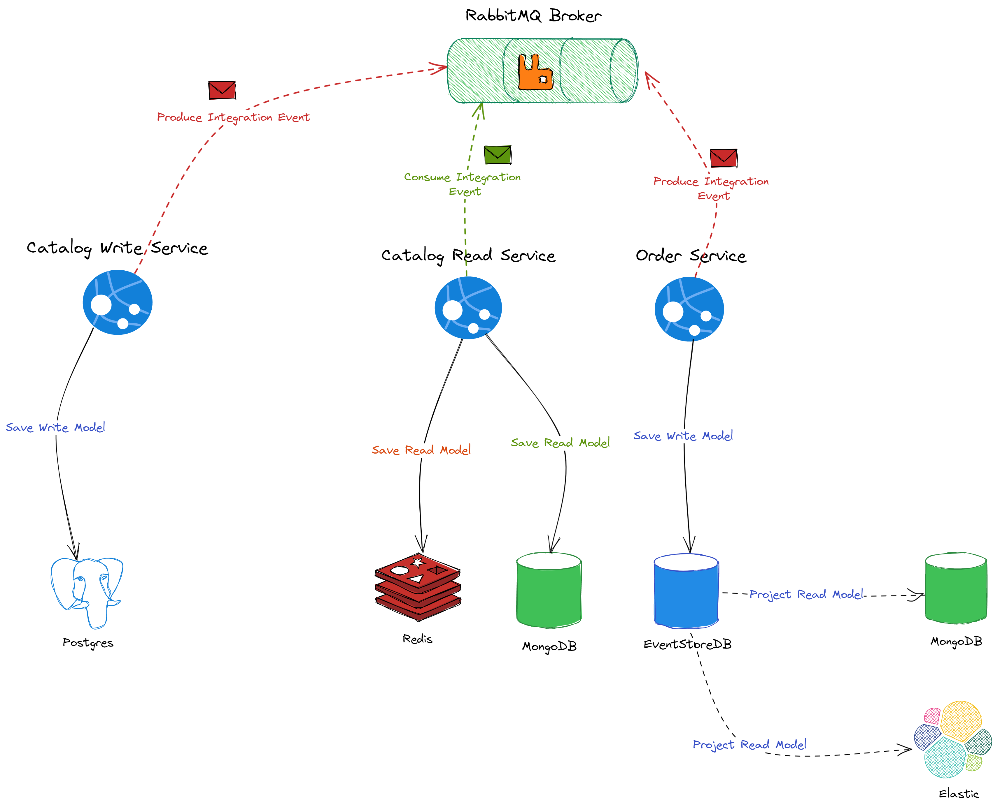
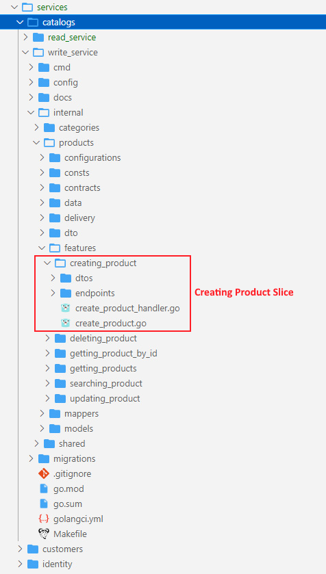
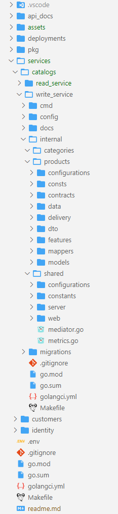

# 🧺Go Ecommerce Microservices

[](https://github.com/mehdihadeli/go-ecommerce-microservices/actions/workflows/ci.yml)

[](http://commitizen.github.io/cz-cli/)

[](https://gitpod.io/#https://github.com/mehdihadeli/go-ecommerce-microservicess)

> A practical e-commerce sample, built with Golang and different software architecture and technologies like **Microservices Architecture**, **Vertical Slice Architecture** , **CQRS Pattern**, **Domain Driven Design (DDD)**, **Event Sourcing**, **Event Driven Architecture** and **Dependency Injection**. For communication between independent services, We use asynchronous messaging with using RabbitMQ, and sometimes we use synchronous communication for real-time communications with using REST and gRPC calls.

**You can use this project as a template to build your Backend project in the Go language on top of this project.**

💡 This application is not `business oriented`` and my focus is mostly on technical part, I just want to implement a sample with using different technologies, software architecture design, principles and all the thing we need for creating a microservices app.

🚀 This Application is `in-progress` and I will add new features and technologies over time.

For your simplest golang projects, you can use my `go-vertical-slice-template` project:

- [https://github.com/mehdihadeli/go-vertical-slice-template](https://github.com/mehdihadeli/go-vertical-slice-template)

For more advance projects, with two `microservices` and `modular monolith architecture`, check the C# version:

- [https://github.com/mehdihadeli/ecommerce-microservices](https://github.com/mehdihadeli/ecommerce-microservices)
- [https://github.com/mehdihadeli/ecommerce-modular-monolith](https://github.com/mehdihadeli/ecommerce-modular-monolith)

## Features

- ✅ Using `Vertical Slice Architecture` as a high level architecture
- ✅ Using `Event Driven Architecture` on top of RabbitMQ Message Broker with a custom [Event Bus](pkg/messaging/bus/)
- ✅ Using `Data Centeric Architecture` based on CRUD in [Catalogs Read Service](services/catalogs/read_service/)
- ✅ Using `Event Sourcing` in `Audit Based` services like [Orders Service](services/orders/)
- ✅ Using `CQRS Pattern` and `Mediator Pattern`on top of [Go-MediatR](https://github.com/mehdihadeli/Go-MediatR) library
- ✅ Using `Dependency Injection` and `Inversion of Control`on top of [uber-go/fx](https://github.com/uber-go/fx) library
- ✅ Using RESTFul api with [Echo](https://github.com/labstack/echo) framework and using swagger with [swaggo/swag](https://github.com/swaggo/swag) library
- ✅ Using gRpc for internal service communication
- ✅ Using [go-playground/validator](https://github.com/go-playground/validator) for validating input data in the REST and gRpc
- ✅ Using `Postgres` and `EventStoreDB` for write databases with fully supports transactions(ACID)
- ✅ Using `MongoDB` and `Elastic Search` for read databases (NOSQL)
- ✅ Using `OpenTelemetry` for collection `Distributed Tracing` with using Jaeger and Zipkin
- ✅ Using `OpenTelemetry` for collection `Metrics` with using Prometheus and Grafana
- ✅ Using `Unit Test` for testing small units with mocking dependent classes and using [Mockery](https://github.com/vektra/mockery) for mocking dependencies
- ✅ Using `End2End Test` and `Integration Test` for testing features with all of their real dependeinces using docker containers (cleanup tests) and [testcontainers-go](https://github.com/testcontainers/testcontainers-go) library
- ✅ Using `Zap` and structured logging
- ✅ Using `Viper` for configuration management
- ✅ Using docker and `docker-compose` for deployment
- 🚧 Using `Domain Driven Design` in some of services like [Catalogs Write Service](services/catalogs/write_service/) and [Orders Service](services/catalogs/orders/)
- 🚧 Using `Helm` and `Kubernetes` for deployment
- 🚧 Using `Outbox Pattern` for all microservices for [Guaranteed Delivery](https://www.enterpriseintegrationpatterns.com/GuaranteedMessaging.html) or [At-least-once Delivery](https://www.cloudcomputingpatterns.org/at_least_once_delivery/)
- 🚧 Using `Inbox Pattern` for handling [Idempotency](https://www.cloudcomputingpatterns.org/idempotent_processor/) in reciver side and [Exactly-once Delivery](https://www.cloudcomputingpatterns.org/exactly_once_delivery/)

## Technologies - Libraries

- ✔️ **[`labstack/echo`](https://github.com/labstack/echo)** - High performance, minimalist Go web framework
- ✔️ **[`uber-go/zap`](https://github.com/uber-go/zap)** - Blazing fast, structured, leveled logging in Go.
- ✔️ **[`emperror/errors`](https://github.com/emperror/errors)** - Drop-in replacement for the standard library errors package and github.com/pkg/errors
- ✔️ **[`open-telemetry/opentelemetry-go`](https://github.com/open-telemetry/opentelemetry-go/)** - OpenTelemetry Go API and SDK
- ✔️ **[`open-telemetry/opentelemetry-go-contrib`](https://github.com/open-telemetry/opentelemetry-go-contrib)** - Collection of extensions for OpenTelemetry-Go.
- ✔️ **[`rabbitmq/amqp091-go`](https://github.com/rabbitmq/amqp091-go)** - An AMQP 0-9-1 Go client maintained by the RabbitMQ team. Originally by @streadway: `streadway/amqp`
- ✔️ **[`stretchr/testify`](https://github.com/stretchr/testify)** - A toolkit with common assertions and mocks that plays nicely with the standard library
- ✔️ **[`mehdihadeli/go-mediatr`](https://github.com/mehdihadeli/go-mediatr)** - Mediator pattern implementation in Golang and helpful in creating CQRS based applications.
- ✔️ **[`grpc-ecosystem/go-grpc-middleware`](https://github.com/grpc-ecosystem/go-grpc-middleware)** - Golang gRPC Middlewares: interceptor chaining, auth, logging, retries and more
- ✔️ **[`grpc/grpc-go`](https://github.com/grpc/grpc-go)** - The Go language implementation of gRPC. HTTP/2 based RPC
- ✔️ **[`elastic/go-elasticsearch`](https://github.com/elastic/go-elasticsearch)** - The official Go client for Elasticsearch
- ✔️ **[`avast/retry-go`](https://github.com/avast/retry-go)** - Simple golang library for retry mechanism
- ✔️ **[`ahmetb/go-linq`](https://github.com/ahmetb/go-linq)** - .NET LINQ capabilities in Go
- ✔️ **[`EventStore/EventStore-Client-Go`](https://github.com/EventStore/EventStore-Client-Go)** - Go Client for Event Store version 20 and above.
- ✔️ **[`olivere/elastic/v7`](https://github.com/olivere/elastic/v7)** - Deprecated: Use the official Elasticsearch client for Go at
- ✔️ **[`swaggo/swag`](https://github.com/swaggo/swag)** - Automatically generate RESTful API documentation with Swagger 2.0 for Go.
- ✔️ **[`prometheus/client_golang`](github.com/prometheus/client_golang)** - Prometheus instrumentation library for Go applications
- ✔️ **[`mongodb/mongo-go-driver`](https://github.com/mongodb/mongo-go-driver)** - The Go driver for MongoDB
- ✔️ **[`go-redis/redis`](https://github.com/go-redis/redis)** - Type-safe Redis client for Golang
- ✔️ **[`go-gorm/gorm`](https://github.com/go-gorm/gorm)** - The fantastic ORM library for Golang, aims to be developer friendly
- ✔️ **[`go-playground/validator`](https://github.com/go-playground/validator)** - Go Struct and Field validation, including Cross Field, Cross Struct, Map, Slice and Array diving
- ✔️ **[`spf13/viper`](https://github.com/spf13/viper)** - Go configuration with fangs
- ✔️ **[`caarlos0/env`](https://github.com/caarlos0/env)** - A simple and zero-dependencies library to parse environment variables into structs.
- ✔️ **[`joho/godotenv`](https://github.com/joho/godotenv)** - A Go port of Ruby's dotenv library (Loads environment variables from .env files)
- ✔️ **[`mcuadros/go-defaults`](https://github.com/mcuadros/go-defaults)** - Go structures with default values using tags
- ✔️ **[`uber-go/fx`](https://github.com/uber-go/fx)** - A dependency injection based application framework for Go.
- ✔️ **[`testcontainers/testcontainers-go`](https://github.com/testcontainers/testcontainers-go)** - Testcontainers for Go is a Go package that makes it simple to create and clean up container-based dependencies for automated integration/smoke tests.

## Project Layout and Structure

Each microservices are based on these projects structure:

- [Standard Go Project Layout](https://github.com/golang-standards/project-layout)

## System Architecture



## Application Structure

In this project I used [vertical slice architecture](https://jimmybogard.com/vertical-slice-architecture/) or [Restructuring to a Vertical Slice Architecture](https://codeopinion.com/restructuring-to-a-vertical-slice-architecture/) also I used [feature folder structure](http://www.kamilgrzybek.com/design/feature-folders/) in this project.

- We treat each request as a distinct use case or slice, encapsulating and grouping all concerns from front-end to back.
- When We adding or changing a feature in an application in n-tire architecture, we are typically touching many different "layers" in an application. we are changing the user interface, adding fields to models, modifying validation, and so on. Instead of coupling across a layer, we couple vertically along a slice and each change affects only one slice.
- We `Minimize coupling` `between slices`, and `maximize coupling` `in a slice`.
- With this approach, each of our vertical slices can decide for itself how to best fulfill the request. New features only add code, we're not changing shared code and worrying about side effects. For implementing vertical slice architecture using cqrs pattern is a good match.


Also here I used [CQRS](https://www.eventecommerce.com/cqrs-pattern) for decompose my features to very small parts that makes our application:

- maximize performance, scalability and simplicity.
- adding new feature to this mechanism is very easy without any breaking change in other part of our codes. New features only add code, we're not changing shared code and worrying about side effects.
- easy to maintain and any changes only affect on one command or query (or a slice) and avoid any breaking changes on other parts
- it gives us better separation of concerns and cross cutting concern (with help of MediatR behavior pipelines) in our code instead of a big service class for doing a lot of things.

With using [CQRS](https://event-driven.io/en/cqrs_facts_and_myths_explained/), our code will be more aligned with [SOLID principles](https://en.wikipedia.org/wiki/SOLID), especially with:

- [Single Responsibility](https://en.wikipedia.org/wiki/Single-responsibility_principle) rule - because logic responsible for a given operation is enclosed in its own type.
- [Open-Closed](https://en.wikipedia.org/wiki/Open%E2%80%93closed_principle) rule - because to add new operation you don’t need to edit any of the existing types, instead you need to add a new file with a new type representing that operation.

Here instead of some [Technical Splitting](http://www.kamilgrzybek.com/design/feature-folders/) for example a folder or layer for our `services`, `controllers` and `data models` which increase dependencies between our technical splitting and also jump between layers or folders, We cut each business functionality into some vertical slices, and inner each of these slices we have [Technical Folders Structure](http://www.kamilgrzybek.com/design/feature-folders/) specific to that feature (command, handlers, infrastructure, repository, controllers, data models, ...).

Usually, when we work on a given functionality we need some technical things for example:

- API endpoint (Controller)
- Request Input (Dto)
- Request Output (Dto)
- Some class to handle Request, For example Command and Command Handler or Query and Query Handler
- Data Model

Now we could all of these things beside each other and it decrease jumping and dependencies between some layers or folders.

Keeping such a split works great with CQRS. It segregates our operations and slices the application code vertically instead of horizontally. In Our CQRS pattern each command/query handler is a separate slice. This is where you can reduce coupling between layers. Each handler can be a separated code unit, even copy/pasted. Thanks to that, we can tune down the specific method to not follow general conventions (e.g. use custom SQL query or even different storage). In a traditional layered architecture, when we change the core generic mechanism in one layer, it can impact all methods.

### Catalogs Service Structure



### High Level Structure



## Formatting

For formatting, I used [mvdan/gofumpt](https://github.com/mvdan/gofumpt), [golines](https://github.com/segmentio/golines) and [golangci-lint](https://golangci-lint.run/usage/integrations/#goland) in my GoLand. you can do this formatting automatically by [this guide](https://github.com/mvdan/gofumpt#goland).

## Live Reloading In Development

For live reloading in dev mode I use [air](https://github.com/cosmtrek/air) library. for guid about using this tools you can [read this article](https://mainawycliffe.dev/blog/live-reloading-golang-using-air/).

For running each microservice in `live reload mode`, inner each service folder type bellow command after [installing air](https://github.com/cosmtrek/air?ref=content.mainawycliffe.dev#via-go-install):

```bash
air
```

## Contribution

The application is in development status. You are feel free to submit pull request or create the issue.

## License

The project is under [MIT license](https://github.com/mehdihadeli/go-ecommerce-microservices/blob/main/LICENSE).

## References

- [https://github.com/AleksK1NG/Go-CQRS-Kafka-gRPC-Microservices](https://github.com/AleksK1NG/Go-CQRS-Kafka-gRPC-Microservices)
- [https://github.com/ThreeDotsLabs/wild-workouts-go-ddd-example](https://github.com/ThreeDotsLabs/wild-workouts-go-ddd-example)
- [https://github.com/kgrzybek/modular-monolith-with-ddd](https://github.com/kgrzybek/modular-monolith-with-ddd)
- [https://github.com/jbogard/ContosoUniversityDotNetCore-Pages](https://github.com/jbogard/ContosoUniversityDotNetCore-Pages)
